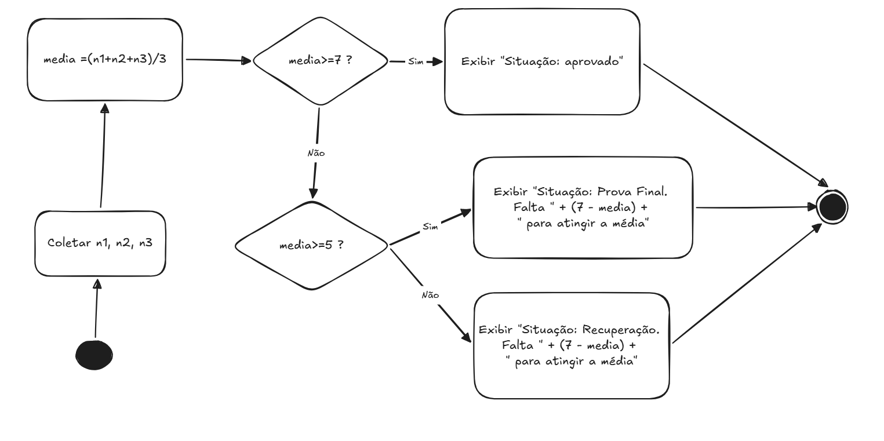

1-
```
inicio
    leia x
    leia y
    z <- x * y + 5
    se z <= 0 entao
        Resultado <- "A"
    senao
        se z <= 100 entao
            Resultado <- "B"
        senao
            Resultado <- "C"
        fim-se
    fim-se
    escrever: z, Resultado
fim
```

### Quadro preenchido

| X | Y | Z | Resultado |
|---:|---:|---:|:---|
| 3 | 2 | 11 | B |
| 150 | 3 | 455 | C |
| 7 | -1 | -2 | A |
| -2 | 5 | -5 | A |
| 50 | 3 | 155 | B |


2-

### Regras media

| Media | Resultado |
|---:|:---|
| 0 até 4,9 | Recuperação |
| 5 até 6,9 | Prova Final |
| 7 até 10 | Aprovado |



3-

4-